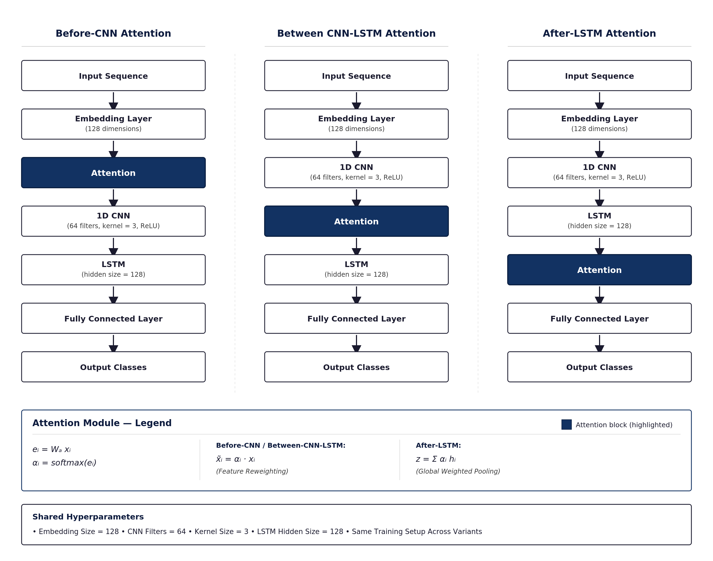
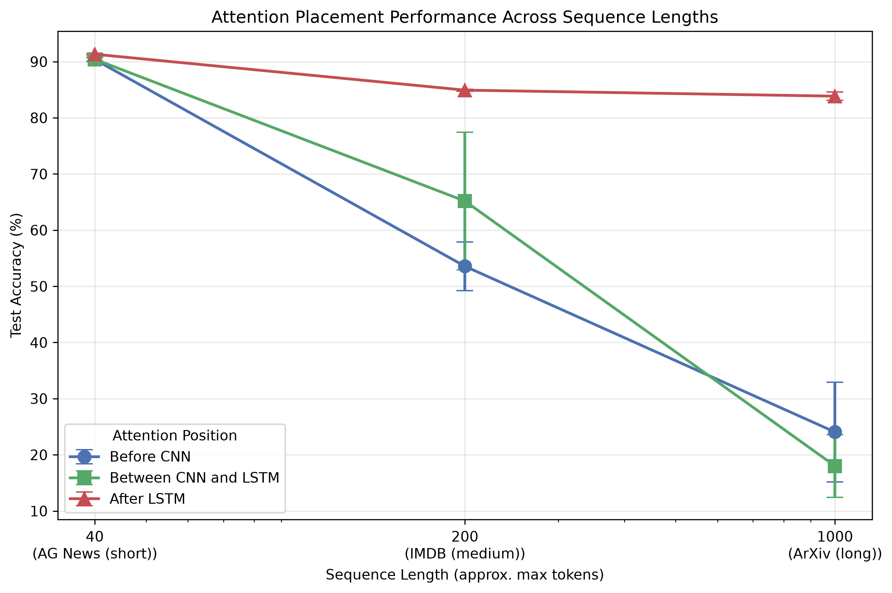
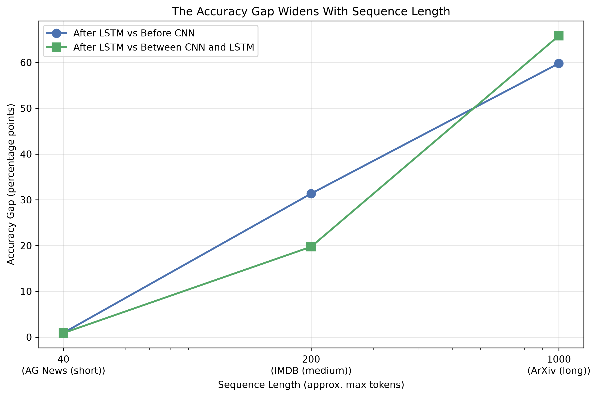

# Attention Placement in CNN-LSTM Architectures — A Controlled Study

Code and results for the Advanced AI course final report:

**"Attention Is All You Need... But Where? A Controlled Study of Attention
Placement in CNN-LSTM Architectures"**

Samih Mejhoudi, supervised by Kuo-Kun Tseng
School of Computer Science and Technology, Harbin Institute of Technology, Shenzhen

---

## What this project does

Attention is commonly added to CNN-LSTM models, but its position in the stack
is usually chosen by convention rather than tested. This project trains the
**same** CNN-LSTM architecture with attention inserted at three different
positions, before the CNN, between the CNN and the LSTM, and after the LSTM,
across three datasets of increasing sequence length, to test whether
placement matters and whether the answer depends on sequence length.

## Architecture



The same attention module is inserted at three points in an identical
CNN-LSTM backbone. Early placements (before the CNN, between the CNN and the
LSTM) reweight the sequence elementwise. The post-LSTM placement pools the
full sequence into a single vector before classification.

## Main finding

Attention placement barely matters on short sequences, but the gap widens
sharply as sequences get longer. Post-LSTM attention stays stable and
accurate across all three datasets; earlier placements become increasingly
unstable and, on the longest sequences, perform close to random guessing
under the standard training budget.





| Dataset | Sequence length | Before CNN | Between | After LSTM |
|---|---|---|---|---|
| AG News | Short (40 tokens) | 90.38% | 90.42% | **91.32%** |
| IMDB | Medium (200 tokens) | 53.57% | 65.18% | **84.93%** |
| ArXiv | Long (1000 tokens) | 24.05% | 18.01% | **83.86%** |

All results are mean accuracy over five random seeds. Differences between
After-LSTM and the earlier placements are statistically significant on every
dataset (paired t-test, p < 0.05), with the gap widening from about 1
percentage point on AG News to over 60 points on ArXiv.

A follow-up convergence analysis (10-epoch diagnostic on ArXiv) shows that
early placements are not incapable of learning, they improve substantially
with more training, but do not close the gap with post-LSTM attention even
after more than three times the standard training budget. See the paper for
the full analysis.

## Files

- `model_base.py` — shared CNN-LSTM-Attention model. One class, `attention_position` argument controls where attention sits.
- `data_loader.py` — loads and tokenizes AG News / IMDB / ArXiv.
- `run_experiments.py` — trains all (position x seed) combinations for one dataset, saves results to `results/*.json`. Resume-safe: interrupted runs can be restarted with the same command.
- `analyze_results.py` — computes accuracy, precision, recall, F1, confusion matrices, significance tests, and accuracy gain tables from a results file.
- `visualize_results.py` — generates all per-dataset figures (accuracy bar, confusion matrices, PRF grouped bar, training time, parameter comparison, significance table, accuracy gain chart).
- `compare_datasets.py` — combines all three datasets' results into the cross-dataset comparison figures and summary shown above.
- `investigate_instability.py` — diagnostic tool that reads per-epoch training loss to check whether a placement is learning slowly or not learning at all.
- `architecture_diagram.py` — generates the architecture figure shown above.
- `requirements.txt` — Python dependencies.

## Setup

```bash
pip install -r requirements.txt
```

## Running

Run each dataset separately:

```bash
python run_experiments.py --dataset agnews --seeds 1 2 3 4 5 --tag final
python run_experiments.py --dataset imdb   --seeds 1 2 3 4 5 --tag final
python run_experiments.py --dataset arxiv  --seeds 1 2 3 4 5 --tag final
```

Each command trains 3 attention positions x 5 seeds = 15 runs, and saves all
metrics (accuracy, precision, recall, F1 via post-processing, timing,
parameter count, per-epoch loss) to `results/<dataset>_seeds1-2-3-4-5_final_results.json`.

Then analyze and visualize:

```bash
python analyze_results.py --file results/agnews_seeds1-2-3-4-5_final_results.json
python visualize_results.py --file results/agnews_seeds1-2-3-4-5_final_results.json
```

And combine all three datasets for the cross-dataset comparison:

```bash
python compare_datasets.py \
    --agnews results/agnews_seeds1-2-3-4-5_final_results.json \
    --imdb results/imdb_seeds1-2-3-4-5_final_results.json \
    --arxiv results/arxiv_seeds1-2-3-4-5_final_results.json
```

## Notes

- Requires internet access to download datasets from Hugging Face on first run (cached locally afterward).
- ArXiv (longest sequences) is much slower on CPU; a free GPU (Google Colab or Kaggle) is recommended for that dataset. `run_experiments.py` automatically uses a GPU if available.
- Use `--limit N` for a fast sanity check on a small subset before committing to a full run (not for reported results).
